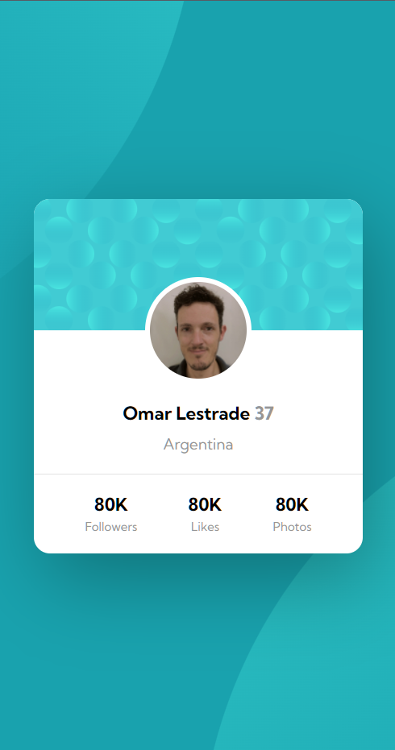

# Frontend Mentor - Profile card component solution

This is a solution to the [Profile card component challenge on Frontend Mentor](https://www.frontendmentor.io/challenges/profile-card-component-cfArpWshJ). Frontend Mentor challenges help you improve your coding skills by building realistic projects. 

## Table of contents

- [Overview](#overview)
  - [The challenge](#the-challenge)
  - [Screenshot](#screenshot)
  - [Links](#links)
- [My process](#my-process)
  - [Built with](#built-with)
  - [What I learned](#what-i-learned)
  - [Continued development](#continued-development)
  - [Useful resources](#useful-resources)
- [Author](#author)
- [Acknowledgments](#acknowledgments)

## Overview

### The challenge

##### Build out the project to the designs provided
- Desktop 


- Mobile


### Screenshot

- Desktop 


- Mobile



Add a screenshot of your solution. The easiest way to do this is to use Firefox to view your project, right-click the page and select "Take a Screenshot". You can choose either a full-height screenshot or a cropped one based on how long the page is. If it's very long, it might be best to crop it.


**Note: Delete this note and the paragraphs above when you add your screenshot. If you prefer not to add a screenshot, feel free to remove this entire section.**

### Links

- Solution URL's: 
  - [Web](https://lestradez.github.io/Profile-Card-Component/)
  - [Code](https://github.com/Lestradez/Profile-Card-Component)


## My process

### Built with

- Semantic HTML5 markupk
- CSS custom properties
- SASS
- Flexbox
- JavaScript

### What I learned

This project helped me remember the existence of Normalize.

Use this section to recap over some of your major learnings while working through this project. Writing these out and providing code samples of areas you want to highlight is a great way to reinforce your own knowledge.

To see how you can add code snippets, see below:

```html
<h1>Some HTML code I'm proud of</h1>
```
```css
.proud-of-this-css {
  color: papayawhip;
}
```
```js
const proudOfThisFunc = () => {
  console.log('🎉')
}
```

If you want more help with writing markdown, we'd recommend checking out [The Markdown Guide](https://www.markdownguide.org/) to learn more.

**Note: Delete this note and the content within this section and replace with your own learnings.**

### Continued development

Use this section to outline areas that you want to continue focusing on in future projects. These could be concepts you're still not completely comfortable with or techniques you found useful that you want to refine and perfect.

**Note: Delete this note and the content within this section and replace with your own plans for continued development.**

### Useful resources

- [BluuWeb Youtube Video Tutorial](https://www.youtube.com/watch?v=Xe_qNR1mmCg&list=PLPl81lqbj-4KC6vBLHq911mmh4AA8_m7N) - This video explains how to solve this chalenge. Thanks to this video I got to know the BluuWeb Youtube channel and the Frontend Mentor site.

## Author

- Website - [Omar Lestrade Z](https://www.lestradez.com.ar) 
- Linkedin - [Omar Lestrade Z](https://www.linkedin.com/in/omar-lestrade/)
- GitHub - [LZDEV @Lestradez](https://github.com/Lestradez)
- Frontend Mentor - [@Lestradez](https://www.frontendmentor.io/profile/Lestradez)


## Acknowledgments

This is where you can give a hat tip to anyone who helped you out on this project. Perhaps you worked in a team or got some inspiration from someone else's solution. This is the perfect place to give them some credit.
